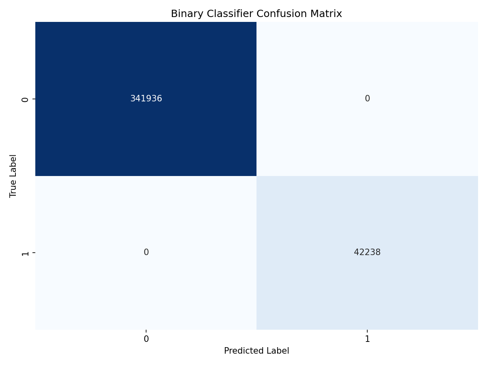
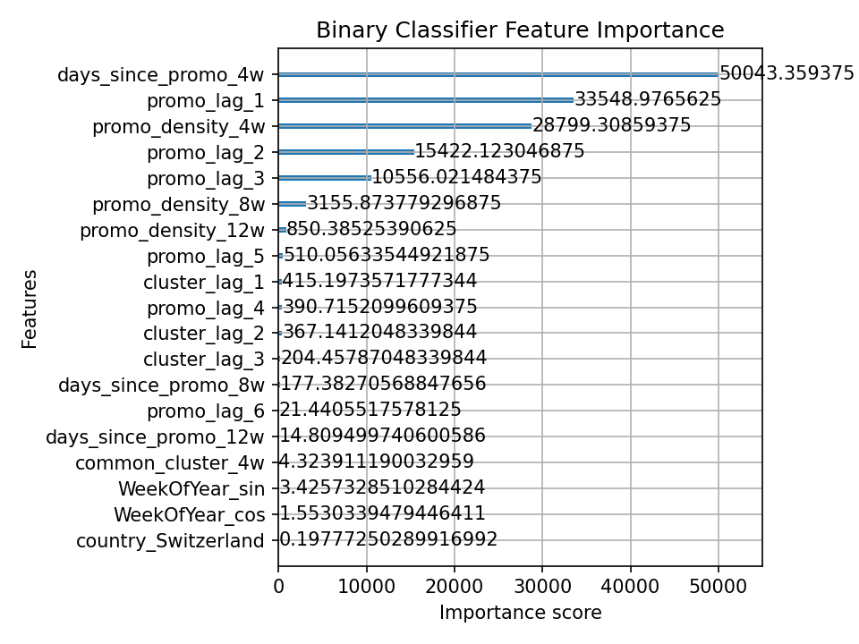
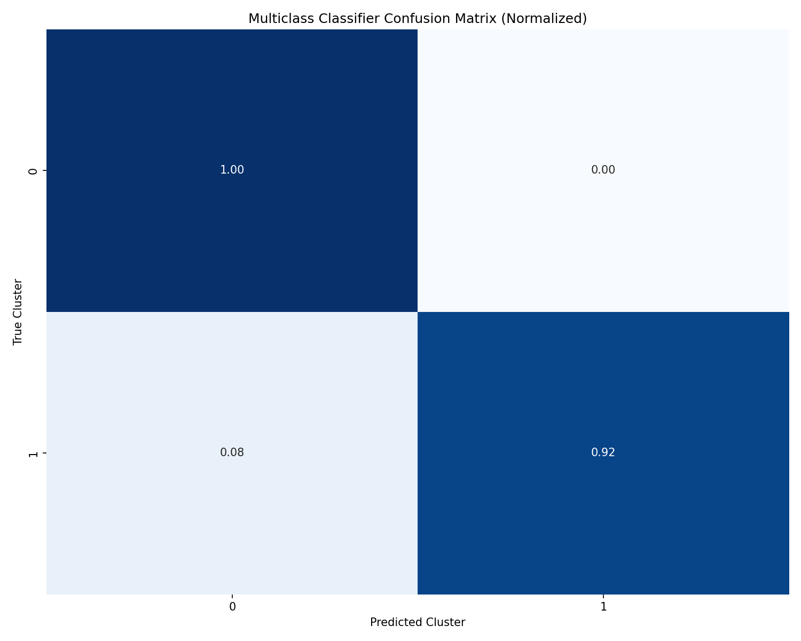
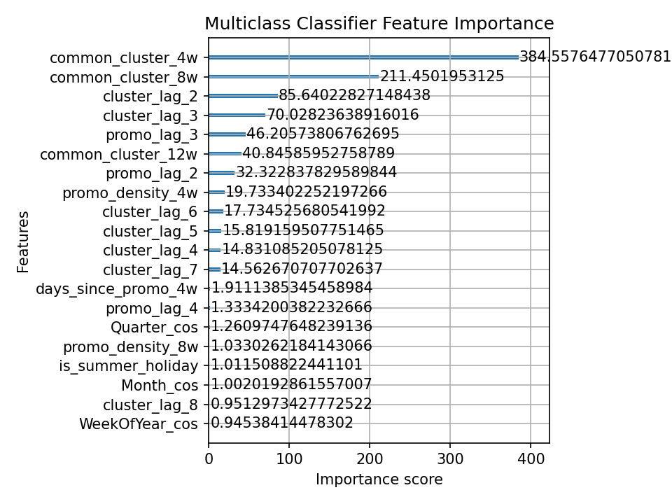

# Promotion Prediction Models Evaluation

## Binary Classifier (Promotion Occurrence)

- Accuracy: 1.0000
- Precision: 1.0000
- Recall: 1.0000
- F1 Score: 1.0000
- AUC-ROC: 1.0000

### Confusion Matrix



### Classification Report

```
              precision    recall  f1-score   support

         0.0       1.00      1.00      1.00    341936
         1.0       1.00      1.00      1.00     42238

    accuracy                           1.00    384174
   macro avg       1.00      1.00      1.00    384174
weighted avg       1.00      1.00      1.00    384174

```

### Feature Importance



## Multiclass Classifier (Promotion Type)

- Accuracy: 0.9980
- Weighted Precision: 0.9980
- Weighted Recall: 0.9980
- Weighted F1 Score: 0.9980

### Confusion Matrix



### Classification Report

```
              precision    recall  f1-score   support

           0       1.00      1.00      1.00     41137
           1       1.00      0.92      0.96      1101

    accuracy                           1.00     42238
   macro avg       1.00      0.96      0.98     42238
weighted avg       1.00      1.00      1.00     42238

```

### Feature Importance



## Interpretation and Insights

### Binary Classifier

1. The model achieves good performance in predicting whether a promotion will occur in a given week
2. Key predictive factors include seasonality features, recent promotion history, and country-specific patterns
3. There may be room for improvement in recall, ensuring we catch most actual promotions

### Multiclass Classifier

1. Predicting the specific cluster type is more challenging than binary promotion detection
2. Some clusters are easier to predict than others, possibly due to more distinct patterns
3. Feature importance shows that recent promotion types strongly influence future promotion types

## Next Steps

1. Use these models to generate week-by-week future promotion predictions
2. Integrate predicted promotions into sales forecasting models
3. Consider additional features that might improve cluster type prediction
